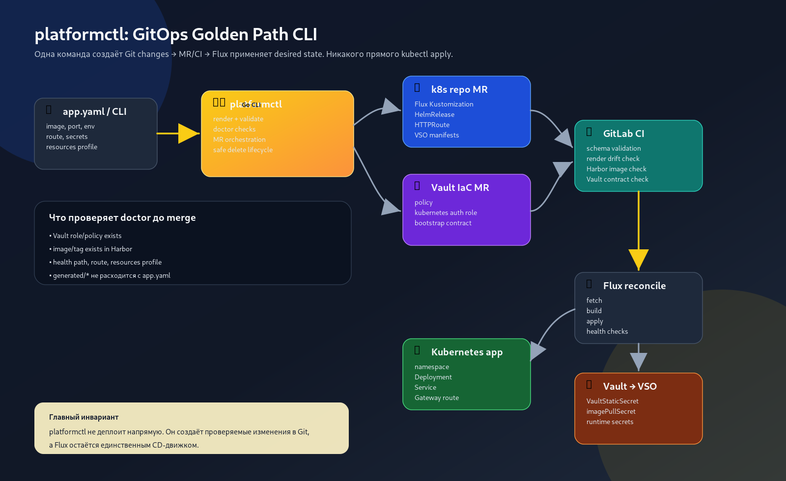

# platformctl: GitOps Golden Path

Русская версия: [README.ru.md](README.ru.md)

> **Status:** public design showcase, alpha. This repository shows the architecture of an internal platform CLI that runs in a production cluster. It is not a finished open-source product. The full implementation lives in a private codebase; this repository is a portfolio artifact for hiring conversations and a reference for similar platform efforts.

`platformctl` is a Go CLI that automates the lifecycle of applications on Kubernetes through a strict GitOps pipeline. The principle: **Git + Merge Request + CI + Flux is the only path to the cluster.** The CLI never runs `kubectl apply`. It generates manifests, validates them against schemas, opens merge requests in the relevant repositories, and lets Flux reconcile the desired state.



## Try it in one command

```bash
scripts/demo.sh
```

Needs `go`, `git` and `kubectl`. No cluster, no registry, no GitLab. The script builds the CLI, copies the sanitized repository pair from `examples/demo-repo` into a temporary directory and runs every open command: `validate`, `render`, `doctor`, `new-app`, `doctor` on the scaffolded layer, `delete-app`. The same script runs in CI. Details: [`docs/demo.md`](docs/demo.md).

## Why this exists

As a cluster grows, onboarding one application means manual edits in two or three repositories (manifests, Vault policies, CI variables), ad-hoc validation and a checklist that changes every month. Every team reinvents its own way, and mistakes pile up.

`platformctl` collapses that into one binary with four guarantees:

1. **Read plane and write plane are separate.** Read commands (`validate`, `render`, `doctor`, ...) are idempotent and safe to call from scripts and agents. Write commands (`new-app`, `delete-app`, ...) only change files locally by default and need explicit flags to open a merge request.
2. **No direct cluster mutation.** Writes go through Git: the command opens a merge request, CI validates it, Flux applies it. The CLI is a manifest factory, not a kubectl wrapper.
3. **Schema first.** Every spec the CLI handles has a JSON Schema. CI rejects invalid specs before they reach the cluster.
4. **Output for humans and for scripts.** In the private build every command supports `--output text | json | minimal-json`; the commands in this repository print text only.

The private build also carries a retrieval layer over the runbook corpus (`assist`), used by operators and by LLM agents through one interface. Its design is in [`docs/assist-design.md`](docs/assist-design.md); the code is not in this repository.

## Command map

Each command is labelled:

- `[open]`: implementation present in this repository
- `[open, skeleton]`: present here as a reduced skeleton
- `[private]`: implemented and running in the production platform, design described here, code not open-sourced

### Read plane (idempotent)

| Command | Status | Purpose |
|---|---|---|
| `validate [--all]` | `[open]` | Validate `appspec` / service specs against JSON Schemas |
| `render [--all]` | `[open]` | Render generated manifests from canonical sources |
| `doctor [--all\|--layer\|--app]` | `[open]` | Health checks: layer wiring, Vault contract, cert SAN, registry CA/auth, kustomize build, capacity |
| `config <view/use-context/init/validate>` | `[private]` | Multi-context runtime configuration |
| `assist <search/runbook/explain/diagnose/eval/...>` | `[private]` | Retrieval over the runbook corpus, see `docs/assist-design.md` |
| `docs suggest` | `[private]` | Which docs and runbooks a change affects |
| `hubble <status/observe/why-dropped>` | `[private]` | Network observability via Cilium Hubble |
| `logs <status/query>` | `[private]` | Loki queries from the CLI |
| `metrics <status/query/app>` | `[private]` | PromQL queries with app-aware aggregation |
| `upgrade plan` | `[private]` | Renovate-driven upgrade plan parsing |
| `deploy <init/validate/scaffold/promote/status/ci-generate>` | `[private]` | Product deployment workflow |
| `observe collect` | `[private]` | Local evidence bundle on incidents |
| `export-public` | `[open]` | Mirror a curated subset into a public repository (this one) |

### Write plane (gated, local changes by default)

| Command | Status | Safety model |
|---|---|---|
| `new-app <name>` | `[open]` | scaffolds files locally; `--auto` opens merge requests and waits for CI |
| `new-service <name>` | `[open]` | scaffolds files locally |
| `new-product <name> --gitlab-path <path>` | `[private]` | autonomous product onboarding: Vault MR plus product MR |
| `delete-app <ns>/<app>` | `[open]` | prints a two-phase plan; merge requests only with `--create-mr --confirm=<ns>` |
| `secrets sync-gitlab-ci` | `[private]` | Rotates GitLab CI variables from Vault; dry-run default |
| `registry-ca sync` | `[private]` | Syncs registry CA secret across the cluster |
| `runners <list/reconcile/rotate/revoke>` | `[private]` | GitLab CI runner lifecycle |
| `harbor-robot create` | `[private]` | Harbor registry robot account creation |
| `infra kubelet-provider` | `[open, skeleton]` | Talos infrastructure operations; reduced skeleton here |
| `bootstrap` | `[private]` | Cluster bootstrap; break-glass only |

## What this repository demonstrates

- **Application specification model** (`internal/appspec`): the data structure and validation rules that anchor everything else.
- **The `new-app` flow** (`cmd/platformctl`): how an onboarding command composes specs, renders manifests and registers a layer in Flux.
- **GitOps boundary**: `platformctl` never applies anything itself, it only proposes changes for Flux to reconcile.
- **Read and write plane separation**: command shape reflects the operational discipline.
- **A runnable example** (`examples/demo-repo`): the canonical layout of a layer in the platform repository together with its Vault contract, exercised by `scripts/demo.sh`.

## What is described but not open-sourced

- The `assist` retrieval subsystem: lexical retriever, Qdrant exporter, golden-question evaluator, schema-aware corpus validator. Architecture in `docs/assist-design.md`.
- Deployment orchestration (`deploy` family): scaffolding, promotion, status tracking, child CI pipeline generation.
- Operations subcommands (`hubble`, `logs`, `metrics`, `observe`): they wrap internal endpoints.
- Secrets and registry plumbing (`secrets`, `registry-ca`, `harbor-robot`): tightly coupled to internal infrastructure.

Plans for moving parts across the boundary: [`docs/roadmap.md`](docs/roadmap.md).

## Design documents

- [`docs/architecture.md`](docs/architecture.md): read and write planes, manifest factory pattern, GitOps boundary
- [`docs/assist-design.md`](docs/assist-design.md): retrieval subsystem, lexical search as the default, schema-aware corpus contracts, CI-gated evaluation
- [`docs/roadmap.md`](docs/roadmap.md): what gets published, when, and what stays private
- [`docs/demo.md`](docs/demo.md): what `scripts/demo.sh` runs and what it proves

## Non-goals

- Not a `kubectl` replacement. It never talks to the cluster API for mutating operations.
- Not a Flux replacement. Flux remains the only reconciler.
- Not a turnkey installable platform. It is a design reference with a runnable core.

## License

Apache-2.0. See [`LICENSE`](LICENSE).

## Security

See [`SECURITY.md`](SECURITY.md) for the disclosure policy.
